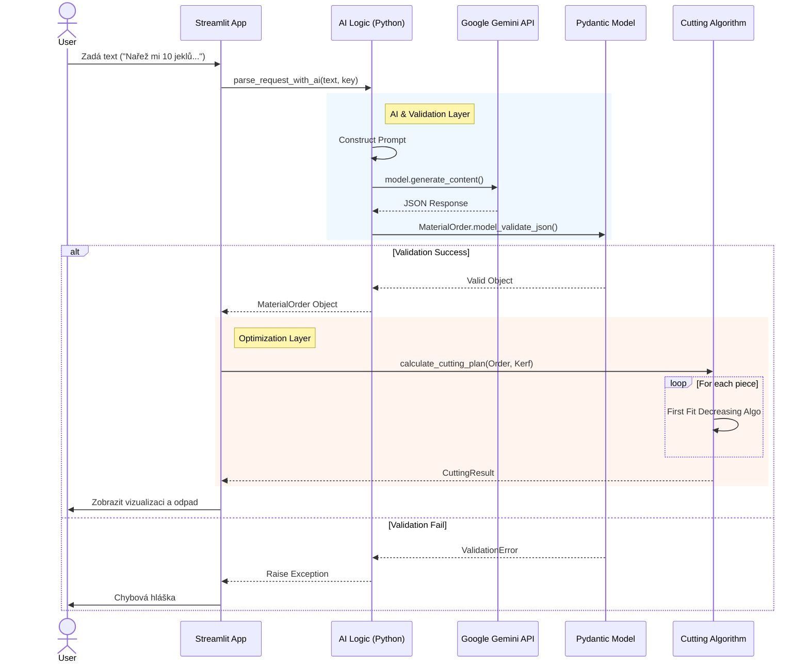

## Architektura

```mermaid
sequenceDiagram
    actor User
    participant UI as Streamlit App
    participant AI as AI Logic (Python)
    participant GoogleAPI as Google Gemini API
    participant Validator as Pydantic Model
    participant Solver as Cutting Algorithm

    User->>UI: Zadá text ("Nařež mi 10 jeklů...")
    UI->>AI: parse_request_with_ai(text, key)
    
    rect rgb(240, 248, 255)
    note right of AI: AI & Validation Layer
    AI->>AI: Construct Prompt
    AI->>GoogleAPI: model.generate_content()
    GoogleAPI-->>AI: JSON Response
    AI->>Validator: MaterialOrder.model_validate_json()
    end

    alt Validation Success
        Validator-->>AI: Valid Object
        AI-->>UI: MaterialOrder Object
        
        rect rgb(255, 245, 238)
        note right of UI: Optimization Layer
        UI->>Solver: calculate_cutting_plan(Order, Kerf)
        loop For each piece
            Solver->>Solver: First Fit Decreasing Algo
        end
        Solver-->>UI: CuttingResult
        end
        
        UI->>User: Zobrazit vizualizaci a odpad
    else Validation Fail
        Validator-->>AI: ValidationError
        AI-->>UI: Raise Exception
        UI->>User: Chybová hláška
    end
```
