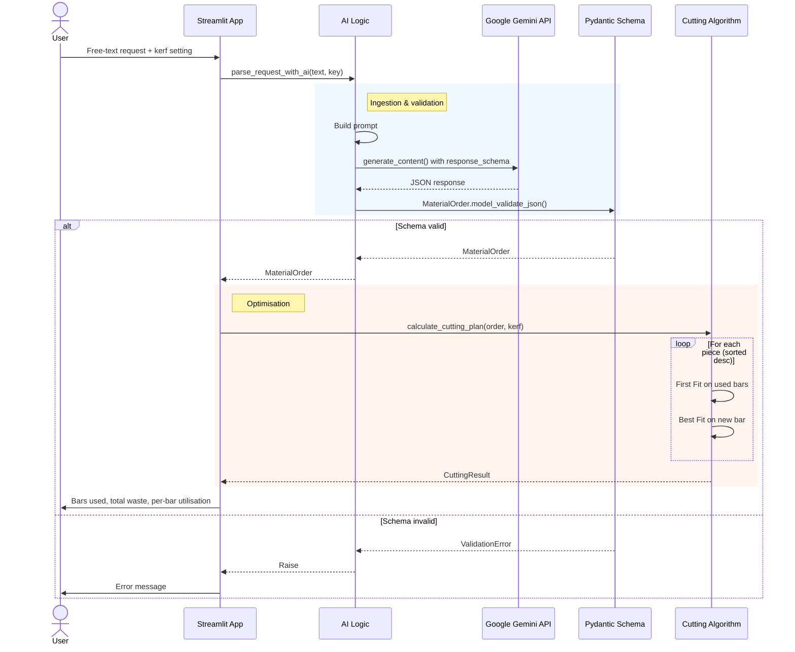

# LLM-Powered Cutting Stock Optimizer

A small experiment in the messy boundary where natural language meets a deterministic algorithm: the user types a cutting request the way a person actually talks (*"Cut me ten 2-metre tubes — we have 6m and 4m stock"*), and the app turns it into a validated cutting plan with utilisation metrics per bar.

The interesting part isn't the optimiser — that's a hybrid First Fit / Best Fit solver for the 1D cutting stock problem. The interesting part is the layer in front of it: getting an LLM to reliably produce structured input that a deterministic algorithm can trust.

## Why this exists

I wanted a small, end-to-end project to think through one specific question: **how do you put an LLM in front of a system that doesn't tolerate hallucinated data?**

A solver that receives `length=120` instead of `length=1200` doesn't crash — it returns a perfectly valid plan for the wrong problem. So the LLM can't just "do its best". Either the input matches the schema, or the request gets rejected before the solver ever sees it.

That's the whole design pressure here.

## How it works

The flow is three layers with one strict gate between them:



**1. Ingestion (LLM).** The user's free-text prompt is wrapped in a system prompt that explains the domain (metalworking, units, defaults). Gemini is invoked with `response_schema=MaterialOrder` directly — no JSON template hand-rolled into the prompt — so the model is constrained at the API level rather than asked nicely.

**2. Validation (Pydantic).** The JSON gets parsed against a `MaterialOrder` schema. Lengths are positive integers in millimetres, quantities are positive integers, and `stock_lengths_mm` must be a non-empty list. Anything else — missing fields, wrong types, hallucinated keys — and the request hard-fails before the solver runs.

This is the load-bearing wall of the whole project. The solver downstream gets to assume its input is sane.

**3. Optimisation (deterministic).** Cuts are sorted longest-first, then placed using **First Fit** on already-opened bars. If nothing fits, a new bar is opened using **Best Fit** across the available stock lengths — picking the shortest stock that can still hold the cut. Kerf width (the saw's blade thickness) is added between cuts on a bar but not before the first cut, which matches how an actual saw operates.

The result includes the cuts per bar, kerf consumed per bar, remainder, and utilisation percentage.

## Tech stack

- **Python 3.10+**
- **Streamlit** — UI; the focus was the pipeline, not a polished frontend
- **Google Gemini API** (`google-generativeai`) with `response_schema` constraint
- **Pydantic** — schema validation

That's it. No external optimisation libraries — the solver is hand-rolled in `solver.py`, deliberately, because the point was to understand it.

## Running it

```bash
git clone https://github.com/janvrzal/llm-cutting-optimizer.git
cd llm-cutting-optimizer
python -m venv venv && source venv/bin/activate
pip install -r requirements.txt
```

You'll need a Google Gemini API key from [aistudio.google.com](https://aistudio.google.com). The app accepts it through the sidebar at runtime — no `.env` required, but you can use one if you prefer.

```bash
streamlit run app.py
```

## Project layout

```
app.py            # Streamlit UI + orchestration
ai_logic.py       # LLM call + Pydantic validation
data_models.py    # Pydantic schema (MaterialOrder, RequestedPiece)
solver.py         # First Fit + Best Fit cutting algorithm
styles.css        # UI tweaks
```

The separation is deliberate: each file has one job, and the boundaries between them are the same boundaries that show up in the architecture diagram.

## What I'd do next

A few things I left out on purpose to keep the project bounded:

- **Cuts that don't fit on any stock length are silently skipped.** They should bubble up as a structured warning in the UI — right now the solver swallows them and the user has no idea why their plan is incomplete.
- **Schema-level unit normalisation.** Right now the prompt asks Gemini to convert everything to millimetres. A cleaner version would let the LLM emit `{"value": 2, "unit": "m"}` and have Pydantic do the conversion in a validator — moving the conversion logic out of the prompt and into testable code.
- **Property-based tests on the validation layer.** The whole correctness story rests on Pydantic catching bad LLM output. That deserves more than the manual testing it currently has — Hypothesis would be a natural fit.
- **A 2D version.** The really interesting cutting stock problems are sheet metal and panels. 1D is the warm-up.
- **Visual layout of cuts per bar.** Progress bars communicate utilisation, but a proper bar diagram (Plotly or Matplotlib) would be more useful for someone actually planning a cut.

## Status

This is a personal learning project, not a product. It works, the pipeline is clean, and it does what it says on the tin — but it's a study in pipeline design, not something I'd point a fabrication shop at.

If you've found this because you're building something similar and want to compare notes on LLM-as-preprocessor patterns, feel free to open an issue.

---

*Built by Jan Vrzal · [github.com/janvrzal](https://github.com/janvrzal)*
