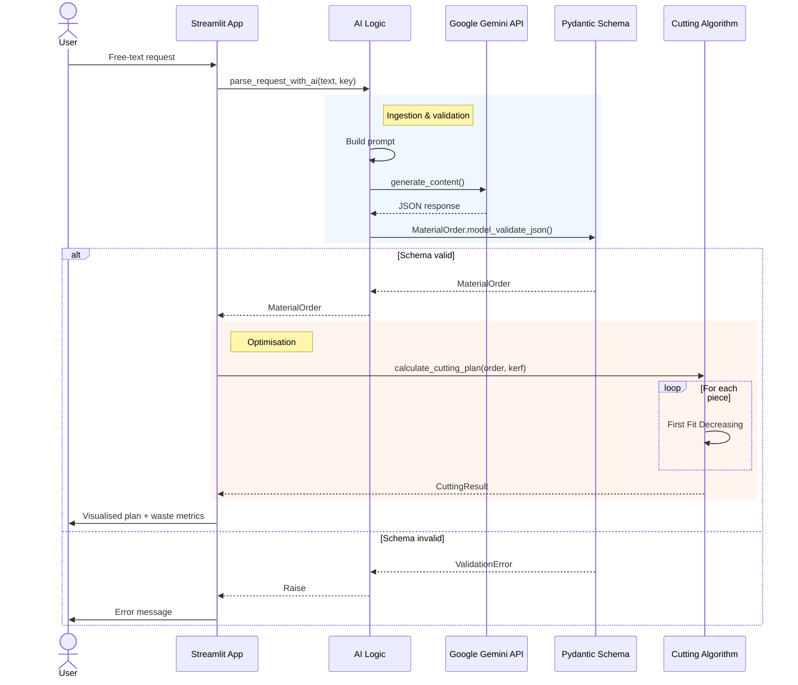

# LLM-Powered Cutting Stock Optimizer

A small experiment in the messy boundary where natural language meets a deterministic algorithm: the user types a cutting request the way a person actually talks (*"Cut me ten 1.2-metre tubes and a couple of half-metre offcuts from 6-metre stock"*), and the app turns it into a validated cutting plan with a visualised layout and waste metrics.

The interesting part isn't the optimiser — that's a textbook **First Fit Decreasing** solver for the 1D cutting stock problem. The interesting part is the layer in front of it: getting an LLM to reliably produce structured input that a deterministic algorithm can trust.

## Why this exists

I wanted a small, end-to-end project to think through one specific question: **how do you put an LLM in front of a system that doesn't tolerate hallucinated data?**

A solver that receives `length=120` instead of `length=1200` doesn't crash — it returns a perfectly valid plan for the wrong problem. So the LLM can't just "do its best". Either the input matches the schema, or the request gets rejected before the solver ever sees it.

That's the whole design pressure here.

## How it works

The flow is three layers with one strict gate between them:



**1. Ingestion (LLM).** The user's free-text prompt is wrapped in a system prompt that defines exactly what the JSON output should look like. Gemini returns JSON. So far, so optimistic.

**2. Validation (Pydantic).** The JSON gets parsed against a `MaterialOrder` schema. Lengths must be positive numbers in millimetres. Quantities must be positive integers. Stock length must be present. Anything else — missing fields, wrong types, hallucinated keys — and the request hard-fails before the solver runs.

This is the whole point. The solver downstream gets to assume its input is sane.

**3. Optimisation (deterministic).** A standard First Fit Decreasing algorithm on the validated order, with a configurable kerf width (the material lost to the saw blade itself). Returns the cut layout per stock piece plus total waste.

## Tech stack

- **Python 3.10+**
- **Streamlit** — UI, because the focus was the pipeline, not the frontend
- **Google Gemini API** — LLM with structured output prompting
- **Pydantic** — schema validation (the load-bearing wall of the whole thing)
- **Matplotlib** — cut-layout visualisation

## Running it

```bash
git clone https://github.com/janvrzal/llm-cutting-optimizer.git
cd llm-cutting-optimizer
python -m venv venv && source venv/bin/activate
pip install -r requirements.txt
```

You'll need a Google Gemini API key. Drop it in `.env`:

```
GOOGLE_API_KEY=your_key_here
```

Then:

```bash
streamlit run app.py
```

## What I'd do next

A few things I left out on purpose to keep the project bounded:

- **Unit on the schema.** Right now lengths are millimetres by convention. A real version would let the LLM normalise mixed units (`"2 metres"`, `"50 cm"`, `"1500 mm"`) and validate the conversion explicitly.
- **Multiple stock lengths.** First Fit Decreasing assumes one stock length. Real workshops have a mix. The solver would need to decide *which* stock to cut from, not just *how* to cut it.
- **A 2D version.** The really interesting cutting stock problems are sheet metal and panels. 1D is the warm-up.
- **Property-based tests on the validation layer.** The whole correctness story rests on Pydantic catching bad LLM output. That deserves more than the manual testing it currently has.

## Status

This is a personal learning project, not a product. It works, the pipeline is clean, and it does what it says on the tin — but it's a study in pipeline design, not something I'd point a fabrication shop at.

If you've found it because you're building something similar and want to compare notes on LLM-as-preprocessor patterns, feel free to open an issue.

---

*Built by Jan Vrzal · [github.com/janvrzal](https://github.com/janvrzal)*
